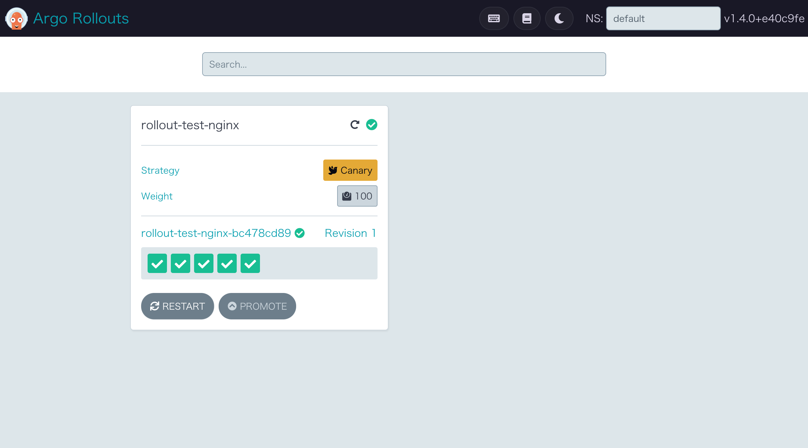
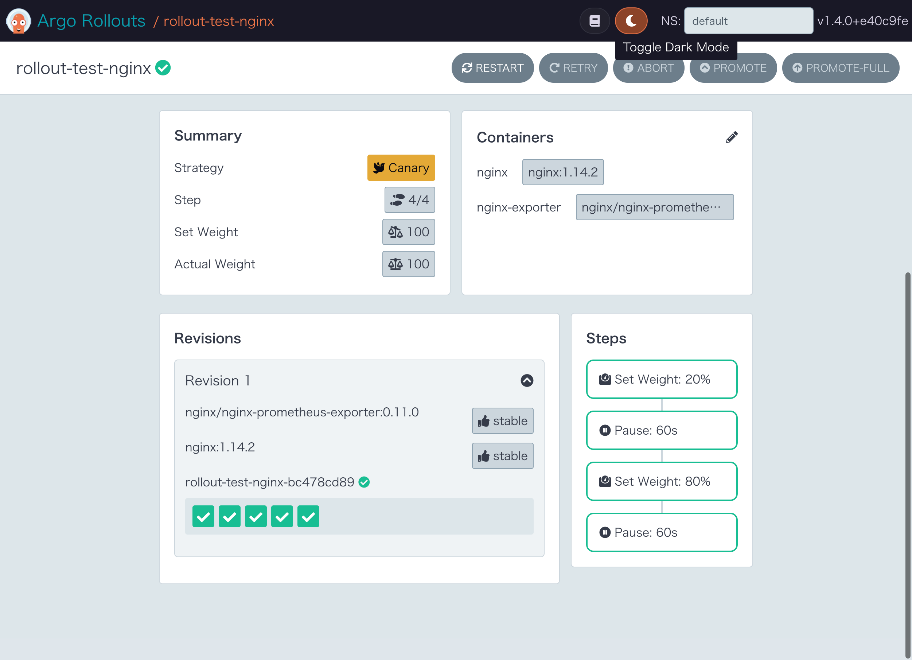

- https://argoproj.github.io/argo-rollouts/installation/
- https://argoproj.github.io/argo-rollouts/features/helm/
- https://github.com/argoproj/argo-helm/tree/main/charts/argo-rollouts

    !!! info
        **`.Values.keepCRDs` が `default: True` のため `helm uninstall` 実行時に `CustomResourceDefinition` Resourceは残ります**

        refs [Chart Values](https://github.com/argoproj/argo-helm/tree/main/charts/argo-rollouts#chart-values)

        ```
        $ kubectl get CustomResourceDefinition | grep argoproj.io
        analysisruns.argoproj.io                         2023-01-29T08:45:21Z
        analysistemplates.argoproj.io                    2023-01-29T08:45:20Z
        clusteranalysistemplates.argoproj.io             2023-01-29T08:45:21Z
        experiments.argoproj.io                          2023-01-29T08:45:21Z
        rollouts.argoproj.io                             2023-01-29T08:45:21Z
        ```

### controller install

1. install with helm
    - https://github.com/argoproj/argo-helm/tree/main/charts/argo-rollouts
        ```
        helm repo add argo https://argoproj.github.io/argo-helm
        helm upgrade -i argo-rollouts argo/argo-rollouts --namespace argo-rollouts --create-namespace
        ```

1. `argo-rollouts` controllerが作成されていることを確認

    <details><summary>deployment</summary>
    ```
    $ kubectl describe deployments -n argo-rollouts argo-rollouts
    Name:               argo-rollouts
    Namespace:          argo-rollouts
    CreationTimestamp:  Sun, 29 Jan 2023 17:45:21 +0900
    Labels:             app.kubernetes.io/component=rollouts-controller
                        app.kubernetes.io/instance=argo-rollouts
                        app.kubernetes.io/managed-by=Helm
                        app.kubernetes.io/name=argo-rollouts
                        app.kubernetes.io/part-of=argo-rollouts
                        app.kubernetes.io/version=v1.4.0
                        helm.sh/chart=argo-rollouts-2.22.1
    Annotations:        deployment.kubernetes.io/revision: 1
                        meta.helm.sh/release-name: argo-rollouts
                        meta.helm.sh/release-namespace: argo-rollouts
    Selector:           app.kubernetes.io/component=rollouts-controller,app.kubernetes.io/instance=argo-rollouts,app.kubernetes.io/name=argo-rollouts
    Replicas:           2 desired | 2 updated | 2 total | 2 available | 0 unavailable
    StrategyType:       Recreate
    MinReadySeconds:    0
    Pod Template:
      Labels:           app.kubernetes.io/component=rollouts-controller
                        app.kubernetes.io/instance=argo-rollouts
                        app.kubernetes.io/name=argo-rollouts
      Service Account:  argo-rollouts
      Containers:
       argo-rollouts:
        Image:       quay.io/argoproj/argo-rollouts:v1.4.0
        Ports:       8090/TCP, 8080/TCP
        Host Ports:  0/TCP, 0/TCP
        Args:
          --leader-elect
        Liveness:     http-get http://:healthz/healthz delay=30s timeout=10s period=20s #success=1 #failure=3
        Readiness:    http-get http://:metrics/metrics delay=15s timeout=4s period=5s #success=1 #failure=3
        Environment:  <none>
        Mounts:       <none>
      Volumes:        <none>
    Conditions:
      Type           Status  Reason
      ----           ------  ------
      Available      True    MinimumReplicasAvailable
      Progressing    True    NewReplicaSetAvailable
    OldReplicaSets:  <none>
    NewReplicaSet:   argo-rollouts-648bff954f (2/2 replicas created)
    Events:
      Type    Reason             Age   From                   Message
      ----    ------             ----  ----                   -------
      Normal  ScalingReplicaSet  118s  deployment-controller  Scaled up replica set argo-rollouts-648bff954f to 2
    ```
    </details>

    <details><summary>pods</summary>
    ```
    $ kubectl get pods -n argo-rollouts
    NAME                             READY   STATUS    RESTARTS   AGE
    argo-rollouts-648bff954f-4svmt   1/1     Running   0          4m22s
    argo-rollouts-648bff954f-bm994   1/1     Running   0          4m22s
    ```
    </details>

1. argo-rollouts controller起動時のログを確認
    - `leader election` が動作していることを確認
        <details><summary>leaderとなったcontroller log</summary>
        ```
        $ kubectl logs -n argo-rollouts argo-rollouts-648bff954f-4svmt
        time="2023-01-29T08:46:03Z" level=info msg="Argo Rollouts starting" version=v1.4.0+e40c9fe
        time="2023-01-29T08:46:03Z" level=info msg="Creating event broadcaster"
        time="2023-01-29T08:46:03Z" level=info msg="Setting up event handlers"
        time="2023-01-29T08:46:03Z" level=info msg="Setting up experiments event handlers"
        time="2023-01-29T08:46:03Z" level=info msg="Setting up analysis event handlers"
        time="2023-01-29T08:46:03Z" level=info msg="Leaderelection get id argo-rollouts-648bff954f-4svmt_01e7fcf9-d81e-4e6b-b311-15706341d8af"
        I0129 08:46:03.959656       1 leaderelection.go:248] attempting to acquire leader lease argo-rollouts/argo-rollouts-controller-lock...
        time="2023-01-29T08:46:03Z" level=info msg="Starting Healthz Server at 0.0.0.0:8080"
        time="2023-01-29T08:46:03Z" level=info msg="Starting Metric Server at 0.0.0.0:8090"
        I0129 08:46:03.999015       1 leaderelection.go:258] successfully acquired lease argo-rollouts/argo-rollouts-controller-lock
        time="2023-01-29T08:46:03Z" level=info msg="New leader elected: argo-rollouts-648bff954f-4svmt_01e7fcf9-d81e-4e6b-b311-15706341d8af"
        time="2023-01-29T08:46:03Z" level=info msg="I am the new leader: argo-rollouts-648bff954f-4svmt_01e7fcf9-d81e-4e6b-b311-15706341d8af"
        time="2023-01-29T08:46:03Z" level=info msg="Starting Controllers"
        time="2023-01-29T08:46:04Z" level=info msg="Waiting for controller's informer caches to sync"
        time="2023-01-29T08:46:04Z" level=info msg="Started controller"
        time="2023-01-29T08:46:04Z" level=info msg="Starting analysis workers"
        time="2023-01-29T08:46:04Z" level=info msg="Started 30 analysis workers"
        time="2023-01-29T08:46:04Z" level=info msg="Starting Experiment workers"
        time="2023-01-29T08:46:04Z" level=info msg="Started Experiment workers"
        time="2023-01-29T08:46:04Z" level=warning msg="Controller is running."
        time="2023-01-29T08:46:04Z" level=info msg="Starting Ingress workers"
        time="2023-01-29T08:46:04Z" level=info msg="Starting Service workers"
        time="2023-01-29T08:46:04Z" level=info msg="Started Ingress workers"
        time="2023-01-29T08:46:04Z" level=info msg="Started Service workers"
        time="2023-01-29T08:46:04Z" level=info msg="Starting Rollout workers"
        time="2023-01-29T08:46:04Z" level=info msg="Started rollout workers"
        ```
        </details>

        <details><summary>leaderではなく待機となったcontroller log</summary>
        ```
        $ kubectl logs -n argo-rollouts argo-rollouts-648bff954f-bm994
        time="2023-01-29T08:46:06Z" level=info msg="Argo Rollouts starting" version=v1.4.0+e40c9fe
        time="2023-01-29T08:46:07Z" level=info msg="Creating event broadcaster"
        time="2023-01-29T08:46:07Z" level=info msg="Setting up event handlers"
        time="2023-01-29T08:46:07Z" level=info msg="Setting up experiments event handlers"
        time="2023-01-29T08:46:07Z" level=info msg="Setting up analysis event handlers"
        time="2023-01-29T08:46:07Z" level=info msg="Leaderelection get id argo-rollouts-648bff954f-bm994_e3f2195c-58be-4086-8d08-1264405dcd59"
        I0129 08:46:07.397481       1 leaderelection.go:248] attempting to acquire leader lease argo-rollouts/argo-rollouts-controller-lock...
        time="2023-01-29T08:46:07Z" level=info msg="Starting Healthz Server at 0.0.0.0:8080"
        time="2023-01-29T08:46:07Z" level=info msg="Starting Metric Server at 0.0.0.0:8090"
        time="2023-01-29T08:46:07Z" level=info msg="New leader elected: argo-rollouts-648bff954f-4svmt_01e7fcf9-d81e-4e6b-b311-15706341d8af"
        ```
        </details>

### kubectl plugin

- https://argoproj.github.io/argo-rollouts/features/kubectl-plugin/
    - `kubectl argo rollouts` コマンドを使えるようにする
        ```
        curl -LO https://github.com/argoproj/argo-rollouts/releases/latest/download/kubectl-argo-rollouts-linux-arm64
        chmod +x kubectl-argo-rollouts-linux-arm64
        sudo mv kubectl-argo-rollouts-linux-arm64 /usr/local/bin/kubectl-argo-rollouts
        ```

        ```
        $ kubectl argo rollouts version
        kubectl-argo-rollouts: v1.4.0+e40c9fe
          BuildDate: 2023-01-09T20:20:38Z
          GitCommit: e40c9fe8a2f7fee9d8ee1c56b4c6c7b983fce135
          GitTreeState: clean
          GoVersion: go1.19.4
          Compiler: gc
          Platform: linux/arm64
        ```

### UI Dashboard

- https://argoproj.github.io/argo-rollouts/dashboard/
- https://argoproj.github.io/argo-rollouts/generated/kubectl-argo-rollouts/kubectl-argo-rollouts_dashboard/
- https://github.com/argoproj/argo-helm/tree/main/charts/argo-rollouts#ui-dashboard
- install
    1. Valuesを追加してhelm installする
        - `dashboard.enabled`
        - `dashboard.service.type` (metallbによるIPアドレスを払い出し、ServiceのLoadBalancer IPアドレスとする)
            ```
            helm upgrade -i argo-rollouts argo/argo-rollouts --namespace argo-rollouts --create-namespace \
              --set dashboard.enabled=true --set dashboard.service.type=LoadBalancer
            ```
    1. Pod
        ```
        $ kubectl get pods -n argo-rollouts
        NAME                                       READY   STATUS    RESTARTS       AGE
        argo-rollouts-648bff954f-4svmt             1/1     Running   1 (4h5m ago)   4h37m
        argo-rollouts-648bff954f-bm994             1/1     Running   0              4h37m
        argo-rollouts-dashboard-6cc9c45468-2hxlq   1/1     Running   0              12m
        ```
    1. Service
        ```
        $ kubectl get service -n argo-rollouts
        NAME                      TYPE           CLUSTER-IP    EXTERNAL-IP     PORT(S)          AGE
        argo-rollouts-dashboard   LoadBalancer   10.32.0.153   192.168.3.203   3100:30809/TCP   51s

        $ kubectl describe service -n argo-rollouts
        Name:                     argo-rollouts-dashboard
        Namespace:                argo-rollouts
        Labels:                   app.kubernetes.io/component=rollouts-dashboard
                                  app.kubernetes.io/instance=argo-rollouts
                                  app.kubernetes.io/managed-by=Helm
                                  app.kubernetes.io/name=argo-rollouts
                                  app.kubernetes.io/part-of=argo-rollouts
                                  app.kubernetes.io/version=v1.4.0
                                  helm.sh/chart=argo-rollouts-2.22.1
        Annotations:              meta.helm.sh/release-name: argo-rollouts
                                  meta.helm.sh/release-namespace: argo-rollouts
        Selector:                 app.kubernetes.io/component=rollouts-dashboard,app.kubernetes.io/instance=argo-rollouts,app.kubernetes.io/name=argo-rollouts
        Type:                     LoadBalancer
        IP Family Policy:         SingleStack
        IP Families:              IPv4
        IP:                       10.32.0.153
        IPs:                      10.32.0.153
        LoadBalancer Ingress:     192.168.3.203
        Port:                     dashboard  3100/TCP
        TargetPort:               3100/TCP
        NodePort:                 dashboard  30809/TCP
        Endpoints:                <none>
        Session Affinity:         None
        External Traffic Policy:  Cluster
        Events:
          Type    Reason       Age   From                Message
          ----    ------       ----  ----                -------
          Normal  IPAllocated  90s   metallb-controller  Assigned IP ["192.168.3.203"]
        ```
    1. ブラウザ
        - { width="300" }
        - { width="300" }


