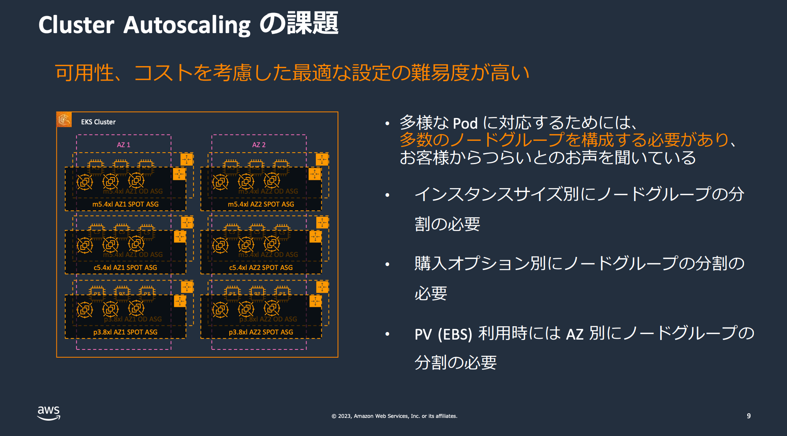
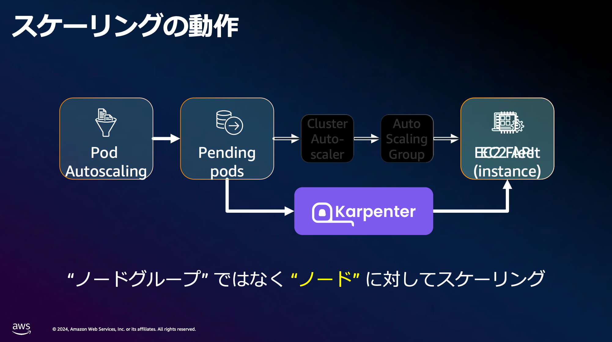

# Karpenter - About Karpenter

[Karpenter (https://karpenter.sh/)](https://karpenter.sh/) はKubernetes Cluster AutoscalerとしてKubernetes ComputeResourceであるNodeのScalingやLifecycleを管理するためのアドオンです。[Cluster Autoscaler](https://github.com/kubernetes/autoscaler/tree/master/cluster-autoscaler) が有名かと思いますがKarpenterはそちらのいくつかの課題点を解決し、かつsimpleな設定で管理することが可能になっています。

## Karpenterの役割

Karpenterは以下のような役割を行います。

1. kube-schedulerがUnschedulableとしたPodの検知
    - ([pkg/utils/pod/scheduling.go#L85-L97](https://github.com/kubernetes-sigs/karpenter/blob/af17c9423d61ee2c8a8c842b11b0619f62a770b5/pkg/utils/pod/scheduling.go#L85-L97)
1. Unschedulable PodのPod Scheduling constraintsの評価
    - resource requests, nodeselectors, affinities, tolerations, and topology spread constraints
1. Node Provisioning
1. 不要なNodeの削除

## Kubernetes Cluster Autoscalerの課題

Karpenterは [Cluster Autoscaler](https://github.com/kubernetes/autoscaler/tree/master/cluster-autoscaler) のいくつかの課題点を解決するためにAWSによって開発され今はkubernetes-sigs projectに

課題とKarpenterの機能紹介についてはAWS Summit 2024の [Amazon EKS + Karpenter で始めるスケーラブルな基盤作り](https://pages.awscloud.com/rs/112-TZM-766/images/AWS-36_DNB-ISV_AWS_Summit_JP_2024.pdf) がとても参考になりました。

### Kubernetes Nodeを柔軟にSchedulingできない

!!! info
    Karpenterでは [NodePool CRDのrequirements section](https://karpenter.sh/docs/concepts/nodepools/#spectemplatespecrequirements) で必要と想定されるEC2 Instance Type, Zone, Architecture, Operating System, Capacity Type(spot or on-demand) などを指定します。Pod Scheduling constraintsを評価した結果、これらの条件に当てはまるNodeをProvisioningします。

Cluster AutoscalerはNode Groupに対してスケーリングを行いますが、AWSでは `"Node Group = ASG"` となります。ASGは (Kubernetes Nodeではなく)EC2のスケーリングに特化しています。

ASGでは柔軟にインスタンスタイプやZONEを指定できません。複数のインスタンスタイプを指定できますがどのインスタンスタイプで起動するのかはASGで決めます。そのためPod Scheduling constraintsを満たすインスタンスタイプを指定して起動することができません。

https://docs.aws.amazon.com/autoscaling/ec2/userguide/allocation-strategies.html

>  Amazon EC2 Auto Scaling launches whichever instance types have the lowest price per your assigned weight values (for example, per vCPU) at the time of fulfillment.

複数のWorkloadsをサポートするためには様々InstanceTypeをサポートする必要があります。Kubernetes Cluster Autoscalerでは複数のNode Groupを作成・管理する必要があり煩雑になってしまいます。

### Kubernetes NodeのProvisioningに時間がかかる

!!! info
    Karpenterでは直接EC2 Fleet APIを呼び出してProvisioningします。EC2の管理をASGではなくKarpenter自身が行うためオーバーヘッドが発生しません。
    

Cluster AutoscalerはUnschedulable Podを検知したらNode group、つまりASGのDesired Capacityの値を変更します。NodeのProvisioningはASGが実施します。そのためEC2 Provisioningまでにオーバーヘッドが存在します。

### References

- https://karpenter.sh/
- https://aws.github.io/aws-eks-best-practices/karpenter/
- https://catalog.workshops.aws/karpenter/en-US
- https://www.eksworkshop.com/docs/autoscaling/compute/karpenter/
- Karpenter 1.0
    - https://aws.amazon.com/jp/blogs/news/announcing-karpenter-1-0/
- YouTube
    - [Karpenter Basic【AWS Black Belt】](https://www.youtube.com/watch?v=ZbG_mVK3bNM)
        - [資料](https://pages.awscloud.com/rs/112-TZM-766/images/AWS-Black-Belt_2023_Karpenter-Basic_1204_v1.pdf)
    - [Kubernetes Meetup Tokyo 67](https://www.youtube.com/watch?v=tz3--1Mf0DU)
        - 1:18:00あたりからの LT `nnouncing Karpenter 1.0`
    - [Karpenter: EKS Cluster Autoscaling](https://www.youtube.com/watch?v=PtsKPlYw3f4&t=235s)
    - [AWS re:Invent 2023 - Harness the power of Karpenter to scale, optimize & upgrade Kubernetes (CON331)](https://www.youtube.com/watch?v=lkg_9ETHeks&t)

- AWS Summit 2024
    - https://pages.awscloud.com/rs/112-TZM-766/images/AWS-36_DNB-ISV_AWS_Summit_JP_2024.pdf
    - https://dev.classmethod.jp/articles/scalable-infrastructure-with-amazon-eks-karpenter-session-report-aws-36/

- (AWS) [Karpenter の魅力と実装にちょっぴり Dive Deep ~ Consolidation 編 ~](https://aws.amazon.com/jp/builders-flash/202409/dive-deep-karpenter/)

