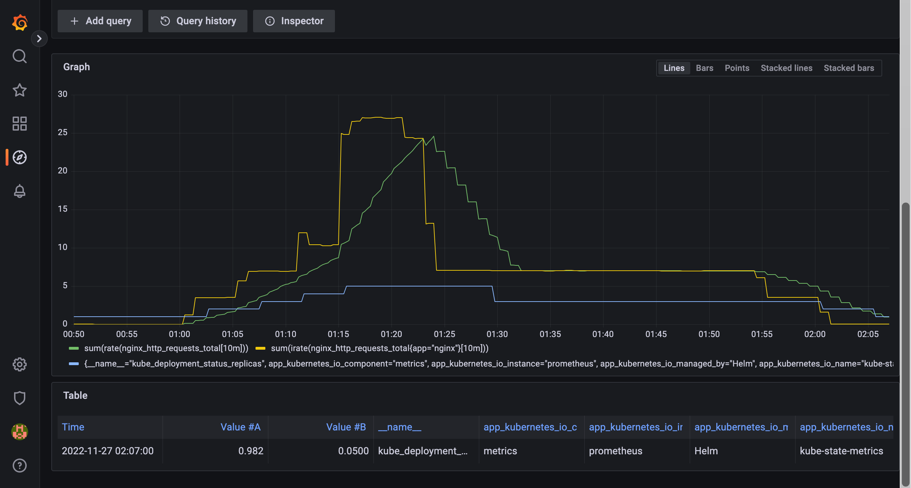

## Install

- https://keda.sh/docs/latest/deploy/

```
helm repo add kedacore https://kedacore.github.io/charts
helm repo update
helm install keda kedacore/keda --namespace keda --create-namespace
```

```
$ kubectl get pods -n keda -w
NAME                                               READY   STATUS    RESTARTS      AGE
keda-operator-54bcdc6446-rf9rc                     1/1     Running   8 (30h ago)   2d21h
keda-operator-metrics-apiserver-74487bb99f-ztqcr   1/1     Running   0             2d21h
```


### 動作確認

#### nginx podでアクセス増減によるscale out/in を確認する

##### Point

- HPAリソースを作成する前にDeploymentリソースの `spec.replica` を削除する
    - https://kubernetes.io/docs/tasks/run-application/horizontal-pod-autoscale/#migrating-deployments-and-statefulsets-to-horizontal-autoscaling
- nginx stub_statusを有効にする
    - http://nginx.org/en/docs/http/ngx_http_stub_status_module.html
- nginx exporterをside carとして追加する
    - https://github.com/nginxinc/nginx-prometheus-exporter
    - `-nginx.scrape-uri=http://localhost/nginx_status` を追加する
    - scrape用Portとして `9113` をexportする

##### 手順

1. deploy

    <details><summary>deployment.yaml</summary>
    ```
    apiVersion: v1
    kind: ConfigMap
    metadata:
      name: nginx-conf
    data:
      nginx.conf: |
        user nginx;
        worker_processes  1;
        error_log  /var/log/nginx/error.log;
        events {
          worker_connections  1024;
        }
        http {
          server {
              listen       80;
              server_name  _;
    
              location / {
                  root   html;
                  index  index.html index.htm;
              }
    
              location /nginx_status {
                  stub_status on;
                  access_log off;
                  allow 127.0.0.1;
                  deny all;
              }
    
          }
        }
    
    ---
    apiVersion: apps/v1
    kind: Deployment
    metadata:
      name: nginx-deployment
    spec:
      selector:
        matchLabels:
          app: nginx

      # HPA導入時にはDeploymentのspec.replicasを削除することが推奨されている
      # refs https://kubernetes.io/docs/tasks/run-application/horizontal-pod-autoscale/#api-object
      # replicas: 2

      template:
        metadata:
          annotations:
            prometheus.io/scrape: 'true'
            prometheus.io/port: '9113'
          labels:
            app: nginx
        spec:
          volumes:
          - name: nginx-conf
            configMap:
              name: nginx-conf
              items:
                - key: nginx.conf
                  path: nginx.conf
          containers:
          - name: nginx
            image: nginx:1.14.2
            ports:
            - containerPort: 80
            volumeMounts:
            - mountPath: /etc/nginx/nginx.conf
              readOnly: true
              name: nginx-conf
              subPath: nginx.conf
          - name: nginx-exporter
            image: nginx/nginx-prometheus-exporter:0.11.0
            args:
              - -nginx.scrape-uri=http://localhost/nginx_status
            ports:
              - containerPort: 9113
    
    ---
    apiVersion: keda.sh/v1alpha1
    kind: ScaledObject
    metadata:
      name: nginx-scaledobject
      labels:
        deploymentName: nginx-deployment
    
    spec:
      fallback:
        failureThreshold: 3
        replicas: 5
      minReplicaCount: 1
      maxReplicaCount: 5
      scaleTargetRef:
        name: nginx-deployment
      triggers:
      - type: prometheus
        metadata:
          serverAddress: http://prometheus-server.monitoring.svc.cluster.local
          metricName: nginx_http_requests_total
          query: sum(rate(nginx_http_requests_total{app="nginx"}[2m]))
          threshold: '3'
    ```
    </details>

    ```
    kubectl apply -f deployment.yaml
    ```

1. Deploymentリソースの `Replicas` を削除
    - HPAリソースの `Replicas` と Deploymentリソースの `Replicas` が競合してしまう
    - https://kubernetes.io/docs/tasks/run-application/horizontal-pod-autoscale/#migrating-deployments-and-statefulsets-to-horizontal-autoscaling

        <details><summary>1. `kubectl.kubernetes.io/last-applied-configuration` annotationsに `spec.replicas` が存在することを確認</summary>
        ```
        $ kubectl get deployment nginx-deployment -o yaml | yq .metadata.annotations
        deployment.kubernetes.io/revision: "1"
        kubectl.kubernetes.io/last-applied-configuration: |
          {"apiVersion":"apps/v1","kind":"Deployment","metadata":{"annotations":{},"name":"nginx-deployment","namespace":"default"},"spec":{"replicas":2,"selector":{"matchLabels":{"app":"nginx"}},"template":{"metadata":{"annotations":{"prometheus.io/port":"9113","prometheus.io/scrape":"true"},"labels":{"app":"nginx"}},"spec":{"containers":[{"image":"nginx:1.14.2","name":"nginx","ports":[{"containerPort":80}],"volumeMounts":[{"mountPath":"/etc/nginx/nginx.conf","name":"nginx-conf","readOnly":true,"subPath":"nginx.conf"}]},{"args":["-nginx.scrape-uri=http://localhost/nginx_status"],"image":"nginx/nginx-prometheus-exporter:0.11.0","name":"nginx-exporter","ports":[{"containerPort":9113}]}],"volumes":[{"configMap":{"items":[{"key":"nginx.conf","path":"nginx.conf"}],"name":"nginx-conf"},"name":"nginx-conf"}]}}}}
        ```
        </details>

        <details><summary>2. `kubectl.kubernetes.io/last-applied-configuration` annotationsの `spec.replicas` を削除</summary>
        ```
        kubectl apply edit-last-applied deployment/nginx-deployment
        ```
        </details>

        <details><summary>3. `kubectl.kubernetes.io/last-applied-configuration` annotationsから `spec.replicas` が削除されていることを確認</summary>
        ```
        $ kubectl get deployment nginx-deployment -o yaml | yq .metadata.annotations
        deployment.kubernetes.io/revision: "1"
        kubectl.kubernetes.io/last-applied-configuration: |
          {"apiVersion":"apps/v1","kind":"Deployment","metadata":{"annotations":{},"name":"nginx-deployment","namespace":"default"},"spec":{"selector":{"matchLabels":{"app":"nginx"}},"template":{"metadata":{"annotations":{"prometheus.io/port":"9113","prometheus.io/scrape":"true"},"labels":{"app":"nginx"}},"spec":{"containers":[{"image":"nginx:1.14.2","name":"nginx","ports":[{"containerPort":80}],"volumeMounts":[{"mountPath":"/etc/nginx/nginx.conf","name":"nginx-conf","readOnly":true,"subPath":"nginx.conf"}]},{"args":["-nginx.scrape-uri=http://localhost/nginx_status"],"image":"nginx/nginx-prometheus-exporter:0.11.0","name":"nginx-exporter","ports":[{"containerPort":9113}]}],"volumes":[{"configMap":{"items":[{"key":"nginx.conf","path":"nginx.conf"}],"name":"nginx-conf"},"name":"nginx-conf"}]}}}}
        ```
        </details>

        <details><summary>4. `deployment.yaml` のDeployment manifestsから `spec.replicas` を削除する</summary>
        ```
        vim deployment.yaml

        や

        sed -i -e '/replicas:\s2/d' deployment.yaml

        など
        ```
        </details>

1. keda-operator logで`ScaledObject` と `HPA` が作成されることを確認
    <details><summary>keda-operator logs</summary>
    ```
    $ kubectl logs -f Deployment/keda-operator -n keda
    
    snip...
    
    2022-11-26T15:37:46Z    INFO    Reconciling ScaledObject        {"controller": "scaledobject", "controllerGroup": "keda.sh", "controllerKind": "ScaledObject", "scaledObject": {"name":"nginx-scaledobject","namespace":"default"}, "namespace": "default", "name": "nginx-scaledobject", "reconcileID": "0085c4c3-03ac-48d9-8b1d-86201dfadf60"}
    2022-11-26T15:37:46Z    INFO    Adding Finalizer for the ScaledObject   {"controller": "scaledobject", "controllerGroup": "keda.sh", "controllerKind": "ScaledObject", "scaledObject": {"name":"nginx-scaledobject","namespace":"default"}, "namespace": "default", "name": "nginx-scaledobject", "reconcileID": "0085c4c3-03ac-48d9-8b1d-86201dfadf60"}
    2022-11-26T15:37:46Z    INFO    Detected resource targeted for scaling  {"controller": "scaledobject", "controllerGroup": "keda.sh", "controllerKind": "ScaledObject", "scaledObject": {"name":"nginx-scaledobject","namespace":"default"}, "namespace": "default", "name": "nginx-scaledobject", "reconcileID": "0085c4c3-03ac-48d9-8b1d-86201dfadf60", "resource": "apps/v1.Deployment", "name": "nginx-deployment"}
    2022-11-26T15:37:46Z    INFO    Creating a new HPA      {"controller": "scaledobject", "controllerGroup": "keda.sh", "controllerKind": "ScaledObject", "scaledObject": {"name":"nginx-scaledobject","namespace":"default"}, "namespace": "default", "name": "nginx-scaledobject", "reconcileID": "0085c4c3-03ac-48d9-8b1d-86201dfadf60", "HPA.Namespace": "default", "HPA.Name": "keda-hpa-nginx-scaledobject"}
    2022-11-26T15:37:46Z    INFO    Initializing Scaling logic according to ScaledObject Specification      {"controller": "scaledobject", "controllerGroup": "keda.sh", "controllerKind": "ScaledObject", "scaledObject": {"name":"nginx-scaledobject","namespace":"default"}, "namespace": "default", "name": "nginx-scaledobject", "reconcileID": "0085c4c3-03ac-48d9-8b1d-86201dfadf60"}
    2022-11-26T15:37:46Z    INFO    Reconciling ScaledObject        {"controller": "scaledobject", "controllerGroup": "keda.sh", "controllerKind": "ScaledObject", "scaledObject": {"name":"nginx-scaledobject","namespace":"default"}, "namespace": "default", "name": "nginx-scaledobject", "reconcileID": "76eb89b7-5ffb-4a53-9165-9a37e184010e"}
    2022-11-26T15:37:46Z    INFO    Reconciling ScaledObject        {"controller": "scaledobject", "controllerGroup": "keda.sh", "controllerKind": "ScaledObject", "scaledObject": {"name":"nginx-scaledobject","namespace":"default"}, "namespace": "default", "name": "nginx-scaledobject", "reconcileID": "645b6f98-fcb8-4710-80b2-2754e673d93b"}
    2022-11-26T15:38:01Z    INFO    Reconciling ScaledObject        {"controller": "scaledobject", "controllerGroup": "keda.sh", "controllerKind": "ScaledObject", "scaledObject": {"name":"nginx-scaledobject","namespace":"default"}, "namespace": "default", "name": "nginx-scaledobject", "reconcileID": "8265c60e-948d-42f7-ae35-11cb7bf7d46f"}
    
    snip...
    ```
    </details>

1. 作成されたリソースを確認する
    <details><summary>HPA</summary>
    ```
    $ kubectl get hpa
    NAME                          REFERENCE                     TARGETS       MINPODS   MAXPODS   REPLICAS   AGE
    keda-hpa-nginx-scaledobject   Deployment/nginx-deployment   17m/3 (avg)   1         5         2          2m45s
    
    $ kubectl get hpa keda-hpa-nginx-scaledobject -o yaml
    apiVersion: autoscaling/v1
    kind: HorizontalPodAutoscaler
    metadata:
      annotations:
        autoscaling.alpha.kubernetes.io/conditions: '[{"type":"AbleToScale","status":"True","lastTransitionTime":"2022-11-26T15:38:01Z","reason":"ReadyForNewScale","message":"recommended
          size matches current size"},{"type":"ScalingActive","status":"True","lastTransitionTime":"2022-12-10T06:28:49Z","reason":"ValidMetricFound","message":"the
          HPA was able to successfully calculate a replica count from external metric
          s0-prometheus-nginx_http_requests_total(\u0026LabelSelector{MatchLabels:map[string]string{scaledobject.keda.sh/name:
          nginx-scaledobject,},MatchExpressions:[]LabelSelectorRequirement{},})"},{"type":"ScalingLimited","status":"False","lastTransitionTime":"2022-11-26T16:27:54Z","reason":"DesiredWithinRange","message":"the
          desired count is within the acceptable range"}]'
        autoscaling.alpha.kubernetes.io/current-metrics: '[{"type":"External","external":{"metricName":"s0-prometheus-nginx_http_requests_total","metricSelector":{"matchLabels":{"scaledobject.keda.sh/name":"nginx-scaledobject"}},"currentValue":"0","currentAverageValue":"16m"}}]'
        autoscaling.alpha.kubernetes.io/metrics: '[{"type":"External","external":{"metricName":"s0-prometheus-nginx_http_requests_total","metricSelector":{"matchLabels":{"scaledobject.keda.sh/name":"nginx-scaledobject"}},"targetAverageValue":"3"}}]'
        kubectl.kubernetes.io/last-applied-configuration: |
          {"apiVersion":"keda.sh/v1alpha1","kind":"ScaledObject","metadata":{"annotations":{},"labels":{"deploymentName":"nginx-deployment"},"name":"nginx-scaledobject","namespace":"default"},"spec":{"fallback":{"failureThreshold":3,"replicas":5},"maxReplicaCount":5,"minReplicaCount":1,"scaleTargetRef":{"name":"nginx-deployment"},"triggers":[{"metadata":{"metricName":"nginx_http_requests_total","query":"sum(rate(nginx_http_requests_total{app=\"nginx\"}[2m]))","serverAddress":"http://prometheus-server.monitoring.svc.cluster.local","threshold":"3"},"type":"prometheus"}]}}
      creationTimestamp: "2022-11-26T15:37:46Z"
      labels:
        app.kubernetes.io/managed-by: keda-operator
        app.kubernetes.io/name: keda-hpa-nginx-scaledobject
        app.kubernetes.io/part-of: nginx-scaledobject
        app.kubernetes.io/version: 2.8.1
        deploymentName: nginx-deployment
        scaledobject.keda.sh/name: nginx-scaledobject
      name: keda-hpa-nginx-scaledobject
      namespace: default
      ownerReferences:
      - apiVersion: keda.sh/v1alpha1
        blockOwnerDeletion: true
        controller: true
        kind: ScaledObject
        name: nginx-scaledobject
        uid: 38ffaf3a-8033-4d97-837a-a919e7f9eaec
      resourceVersion: "12875576"
      uid: 02e4603e-bd98-45b2-9c39-2e89f81393a2
    spec:
      maxReplicas: 5
      minReplicas: 1
      scaleTargetRef:
        apiVersion: apps/v1
        kind: Deployment
        name: nginx-deployment
    status:
      currentReplicas: 1
      desiredReplicas: 1
      lastScaleTime: "2022-12-03T07:40:28Z"metadata:
      annotations:
        autoscaling.alpha.kubernetes.io/conditions: '[{"type":"AbleToScale","status":"True","lastTransitionTime":"2022-11-26T15:38:01Z","reason":"ReadyForNewScale","message":"recommended
          size matches current size"},{"type":"ScalingActive","status":"True","lastTransitionTime":"2022-12-10T06:28:49Z","reason":"ValidMetricFound","message":"the
          HPA was able to successfully calculate a replica count from external metric
          s0-prometheus-nginx_http_requests_total(\u0026LabelSelector{MatchLabels:map[string]string{scaledobject.keda.sh/name:
          nginx-scaledobject,},MatchExpressions:[]LabelSelectorRequirement{},})"},{"type":"ScalingLimited","status":"False","lastTransitionTime":"2022-11-26T16:27:54Z","reason":"DesiredWithinRange","message":"the
          desired count is within the acceptable range"}]'
        autoscaling.alpha.kubernetes.io/current-metrics: '[{"type":"External","external":{"metricName":"s0-prometheus-nginx_http_requests_total","metricSelector":{"matchLabels":{"scaledobject.keda.sh/name":"nginx-scaledobject"}},"currentValue":"0","currentAverageValue":"16m"}}]'
        autoscaling.alpha.kubernetes.io/metrics: '[{"type":"External","external":{"metricName":"s0-prometheus-nginx_http_requests_total","metricSelector":{"matchLabels":{"scaledobject.keda.sh/name":"nginx-scaledobject"}},"targetAverageValue":"3"}}]'
        kubectl.kubernetes.io/last-applied-configuration: |
          {"apiVersion":"keda.sh/v1alpha1","kind":"ScaledObject","metadata":{"annotations":{},"labels":{"deploymentName":"nginx-deployment"},"name":"nginx-scaledobject","namespace":"default"},"spec":{"fallback":{"failureThreshold":3,"replicas":5},"maxReplicaCount":5,"minReplicaCount":1,"scaleTargetRef":{"name":"nginx-deployment"},"triggers":[{"metadata":{"metricName":"nginx_http_requests_total","query":"sum(rate(nginx_http_requests_total{app=\"nginx\"}[2m]))","serverAddress":"http://prometheus-server.monitoring.svc.cluster.local","threshold":"3"},"type":"prometheus"}]}}
      creationTimestamp: "2022-11-26T15:37:46Z"
      labels:
        app.kubernetes.io/managed-by: keda-operator
        app.kubernetes.io/name: keda-hpa-nginx-scaledobject
        app.kubernetes.io/part-of: nginx-scaledobject
        app.kubernetes.io/version: 2.8.1
        deploymentName: nginx-deployment
        scaledobject.keda.sh/name: nginx-scaledobject
      name: keda-hpa-nginx-scaledobject
      namespace: default
      ownerReferences:
      - apiVersion: keda.sh/v1alpha1
        blockOwnerDeletion: true
        controller: true
        kind: ScaledObject
        name: nginx-scaledobject
        uid: 38ffaf3a-8033-4d97-837a-a919e7f9eaec
      resourceVersion: "12875576"
      uid: 02e4603e-bd98-45b2-9c39-2e89f81393a2
    spec:
      maxReplicas: 5
      minReplicas: 1
      scaleTargetRef:
        apiVersion: apps/v1
        kind: Deployment
        name: nginx-deployment
    status:
      currentReplicas: 1
      desiredReplicas: 1
      lastScaleTime: "2022-12-03T07:40:28Z"

    $ kubectl describe hpa keda-hpa-nginx-scaledobject
    Name:                                                                keda-hpa-nginx-scaledobject
    Namespace:                                                           default
    Labels:                                                              app.kubernetes.io/managed-by=keda-operator
                                                                         app.kubernetes.io/name=keda-hpa-nginx-scaledobject
                                                                         app.kubernetes.io/part-of=nginx-scaledobject
                                                                         app.kubernetes.io/version=2.8.1
                                                                         deploymentName=nginx-deployment
                                                                         scaledobject.keda.sh/name=nginx-scaledobject
    Annotations:                                                         <none>
    CreationTimestamp:                                                   Sun, 27 Nov 2022 00:37:46 +0900
    Reference:                                                           Deployment/nginx-deployment
    Metrics:                                                             ( current / target )
      "s0-prometheus-nginx_http_requests_total" (target average value):  17m / 3
    Min replicas:                                                        1
    Max replicas:                                                        5
    Deployment pods:                                                     2 current / 2 desired
    Conditions:
      Type            Status  Reason               Message
      ----            ------  ------               -------
      AbleToScale     True    ScaleDownStabilized  recent recommendations were higher than current one, applying the highest recent recommendation
      ScalingActive   True    ValidMetricFound     the HPA was able to successfully calculate a replica count from external metric s0-prometheus-nginx_http_requests_total(&LabelSelector{MatchLabels:map[string]string{scaledobject.keda.sh/name: nginx-scaledobject,},MatchExpressions:[]LabelSelectorRequirement{},})
      ScalingLimited  False   DesiredWithinRange   the desired count is within the acceptable range
    Events:           <none>
    ```
    </details>


    <details><summary>ScaledObject</summary>
    ```
    $ kubectl get scaledobject
    NAME                 SCALETARGETKIND      SCALETARGETNAME    MIN   MAX   TRIGGERS     AUTHENTICATION   READY   ACTIVE   FALLBACK   AGE
    nginx-scaledobject   apps/v1.Deployment   nginx-deployment   1     5     prometheus                    True    True     False      2m58s
    
    $ kubectl describe scaledobject nginx-scaledobject
    Name:         nginx-scaledobject
    Namespace:    default
    Labels:       deploymentName=nginx-deployment
                  scaledobject.keda.sh/name=nginx-scaledobject
    Annotations:  <none>
    API Version:  keda.sh/v1alpha1
    Kind:         ScaledObject
    Metadata:
      Creation Timestamp:  2022-11-26T15:37:46Z
      Finalizers:
        finalizer.keda.sh
      Generation:  1
      Managed Fields:
        API Version:  keda.sh/v1alpha1
        Fields Type:  FieldsV1
        fieldsV1:
          f:metadata:
            f:finalizers:
              .:
              v:"finalizer.keda.sh":
            f:labels:
              f:scaledobject.keda.sh/name:
        Manager:      keda
        Operation:    Update
        Time:         2022-11-26T15:37:46Z
        API Version:  keda.sh/v1alpha1
        Fields Type:  FieldsV1
        fieldsV1:
          f:metadata:
            f:annotations:
              .:
              f:kubectl.kubernetes.io/last-applied-configuration:
            f:labels:
              .:
              f:deploymentName:
          f:spec:
            .:
            f:fallback:
              .:
              f:failureThreshold:
              f:replicas:
            f:maxReplicaCount:
            f:minReplicaCount:
            f:scaleTargetRef:
              .:
              f:name:
            f:triggers:
        Manager:      kubectl-client-side-apply
        Operation:    Update
        Time:         2022-11-26T15:37:46Z
        API Version:  keda.sh/v1alpha1
        Fields Type:  FieldsV1
        fieldsV1:
          f:status:
            f:health:
              .:
              f:s0-prometheus-nginx_http_requests_total:
                .:
                f:numberOfFailures:
                f:status:
        Manager:      keda-adapter
        Operation:    Update
        Subresource:  status
        Time:         2022-11-26T15:38:01Z
        API Version:  keda.sh/v1alpha1
        Fields Type:  FieldsV1
        fieldsV1:
          f:status:
            .:
            f:conditions:
            f:externalMetricNames:
            f:hpaName:
            f:lastActiveTime:
            f:originalReplicaCount:
            f:scaleTargetGVKR:
              .:
              f:group:
              f:kind:
              f:resource:
              f:version:
            f:scaleTargetKind:
        Manager:         keda
        Operation:       Update
        Subresource:     status
        Time:            2022-11-26T15:39:46Z
      Resource Version:  10027225
      UID:               38ffaf3a-8033-4d97-837a-a919e7f9eaec
    Spec:
      Fallback:
        Failure Threshold:  3
        Replicas:           5
      Max Replica Count:    5
      Min Replica Count:    1
      Scale Target Ref:
        Name:  nginx-deployment
      Triggers:
        Metadata:
          Metric Name:     nginx_http_requests_total
          Query:           sum(rate(nginx_http_requests_total{app="nginx"}[2m]))
          Server Address:  http://prometheus-server.monitoring.svc.cluster.local
          Threshold:       3
        Type:              prometheus
    Status:
      Conditions:
        Message:  ScaledObject is defined correctly and is ready for scaling
        Reason:   ScaledObjectReady
        Status:   True
        Type:     Ready
        Message:  Scaling is performed because triggers are active
        Reason:   ScalerActive
        Status:   True
        Type:     Active
        Message:  No fallbacks are active on this scaled object
        Reason:   NoFallbackFound
        Status:   False
        Type:     Fallback
      External Metric Names:
        s0-prometheus-nginx_http_requests_total
      Health:
        s0-prometheus-nginx_http_requests_total:
          Number Of Failures:  0
          Status:              Happy
      Hpa Name:                keda-hpa-nginx-scaledobject
      Last Active Time:        2022-11-26T15:41:16Z
      Original Replica Count:  2
      Scale Target GVKR:
        Group:            apps
        Kind:             Deployment
        Resource:         deployments
        Version:          v1
      Scale Target Kind:  apps/v1.Deployment
    Events:
      Type    Reason              Age    From           Message
      ----    ------              ----   ----           -------
      Normal  KEDAScalersStarted  3m54s  keda-operator  Started scalers watch
      Normal  ScaledObjectReady   3m54s  keda-operator  ScaledObject is ready for scaling
    ```
    </details>

1. 負荷をかける
    - nginxコンテナにattachして `http://localhost/nginx_status` に対してのアクセスを増やしてみる

1. scaleout/scalein を確認
    <details>
    ```
    $ while true; do date ; kubectl describe hpa keda-hpa-nginx-scaledobject | grep -A 30 "^Metrics:" ; echo ; echo ; sleep 1 ; done
    
    snip...
    
    2022年 11月27日 日曜日 02時06分09秒 JST
    Metrics:                                                             ( current / target )
      "s0-prometheus-nginx_http_requests_total" (target average value):  33m / 3
    Min replicas:                                                        1
    Max replicas:                                                        5
    Deployment pods:                                                     1 current / 1 desired
    Conditions:
      Type            Status  Reason              Message
      ----            ------  ------              -------
      AbleToScale     True    ReadyForNewScale    recommended size matches current size
      ScalingActive   True    ValidMetricFound    the HPA was able to successfully calculate a replica count from external metric s0-prometheus-nginx_http_requests_total(&LabelSelector{MatchLabels:map[string]string{scaledobject.keda.sh/name: nginx-scaledobject,},MatchExpressions:[]LabelSelectorRequirement{},})
      ScalingLimited  False   DesiredWithinRange  the desired count is within the acceptable range
    Events:
      Type    Reason             Age                From                       Message
      ----    ------             ----               ----                       -------
      Normal  SuccessfulRescale  59m                horizontal-pod-autoscaler  New size: 3; reason: external metric s0-prometheus-nginx_http_requests_total(&LabelSelector{MatchLabels:map[string]string{scaledobject.keda.sh/name: nginx-scaledobject,},MatchExpressions:[]LabelSelectorRequirement{},}) above target
      Normal  SuccessfulRescale  54m                horizontal-pod-autoscaler  New size: 4; reason: external metric s0-prometheus-nginx_http_requests_total(&LabelSelector{MatchLabels:map[string]string{scaledobject.keda.sh/name: nginx-scaledobject,},MatchExpressions:[]LabelSelectorRequirement{},}) above target
      Normal  SuccessfulRescale  51m                horizontal-pod-autoscaler  New size: 5; reason: external metric s0-prometheus-nginx_http_requests_total(&LabelSelector{MatchLabels:map[string]string{scaledobject.keda.sh/name: nginx-scaledobject,},MatchExpressions:[]LabelSelectorRequirement{},}) above target
      Normal  SuccessfulRescale  37m                horizontal-pod-autoscaler  New size: 3; reason: All metrics below target
      Normal  SuccessfulRescale  5m45s              horizontal-pod-autoscaler  New size: 2; reason: All metrics below target
      Normal  SuccessfulRescale  42s (x2 over 83m)  horizontal-pod-autoscaler  New size: 1; reason: All metrics below target
    ```
    </details>

1. grafanaで確認
    - green: `sum(rate(nginx_http_requests_total[10m]))`
    - yellow: `sum(irate(nginx_http_requests_total{app="nginx"}[10m]))`
    - blue: `kube_deployment_status_replicas{deployment="nginx-deployment"}`
        

