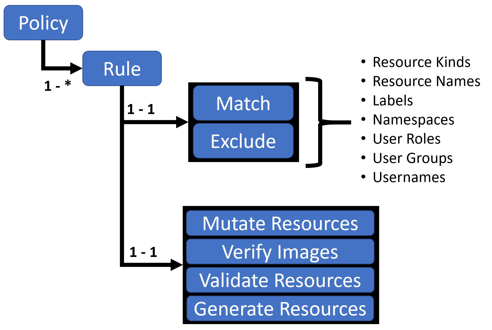

# Kyverno

## About Kyverno

- https://kyverno.io/docs/introduction/
- Kyverno はKubernetesのために設計されたPolicy Engineです。
    - [Open Policy Agent(OPA)](https://www.openpolicyagent.org/) のRegoのように独自言語を覚える必要はなくCustomResourceDefinition(CRD)で定義を行うことができます

## About Kyverno Policy

- 以下図は [こちら](https://kyverno.io/docs/kyverno-policies/) から抜粋
    - { width="300" }

- Kyverno Policyは1つ以上のルールのコレクションです。
- 1つのルールは2つの宣言を持ちます
    1. Policy適用対象リソースの選択
        - [Select Resources](https://kyverno.io/docs/writing-policies/match-exclude/)
    1. Policy適用
        - [Mutate Resources](https://kyverno.io/docs/writing-policies/mutate/)
        - [Validate Resources](https://kyverno.io/docs/writing-policies/validate/)
        - [Generate Resources](https://kyverno.io/docs/writing-policies/generate/)
        - [VerifyImages Resources](https://kyverno.io/docs/writing-policies/verify-images/)

### Kind of Policy

- Cluster wideに適用される `ClusterPolicy` と namespace単位に適用される `Policy` がある
    - [kyverno.io/v1.ClusterPolicy](https://htmlpreview.github.io/?https://github.com/kyverno/kyverno/blob/main/docs/crd/v1/index.html#kyverno.io/v1.ClusterPolicy)
    - [kyverno.io/v1.Policy](https://htmlpreview.github.io/?https://github.com/kyverno/kyverno/blob/main/docs/crd/v1/index.html#kyverno.io/v1.Policy)

### Kind of Resources

#### [Select Resources](https://kyverno.io/docs/writing-policies/match-exclude/)

- Mutate/VerifyImages/Validate/Generate などのpolicyを適用する対象リソースを指定する
    - 対象としたいリソースを`match`で、対象外としたいリソースを`exclude` で指定する
    - any(`OR`) もしくは all(`AND`)の条件下で [resource filters](https://kyverno.io/docs/writing-policies/match-exclude/#resource-filters) を指定
        - `resources`: select resources by names, namespaces, kinds, label selectors, annotations, and namespace selectors.
        - `subjects`: select users, user groups, and service accounts
        - `roles`: select namespaced roles
        - `clusterRoles`: select cluster wide roles

#### [Mutate Resources](https://kyverno.io/docs/writing-policies/mutate/)

- ruleに応じてマニフェストを書き換える
    - 書き換えたい内容は `RFC 6902 JSON Patch`、`a strategic merge patch`、`an overlay pattern` のいずれかで定義可能
    - [RFC 6902 JSON Patch](https://kyverno.io/docs/writing-policies/mutate/#rfc-6902-jsonpatch)
    - [Strategic Merge Patch](https://kyverno.io/docs/writing-policies/mutate/#strategic-merge-patch)
    - an overlay pattern
        - [Conditional logic using anchors](https://kyverno.io/docs/writing-policies/mutate/#conditional-logic-using-anchors)
        - [Mutate Rule Ordering](https://kyverno.io/docs/writing-policies/mutate/#mutate-rule-ordering-cascading)

#### [Validate Resources](https://kyverno.io/docs/writing-policies/validate/)

- これから適用するmanifests、または作成済みリソースに関してポリシー違反がないかどうかを検証する
- `spec.validationFailureAction`
    - `enforce`
        - 新規作成の場合は拒否する
    - `audit`
        - 作成は拒否しない
        - `ClusterPolicyReport` または `PolicyReport` を作成しポリシー違反を記録する
- `spec.background`
    - 当該 `ClusterPolicy` または `Policy` に関してポリシー違反をしていないかどうかを作成済みリソースに検証する
    - (`enforce`の場合でも) 作成済みリソースのポリシー違反は`ClusterPolicyReport` または `PolicyReport` を作成しポリシー違反を記録する
- Patterns
    - `spec.rules[*].va1lidate.pattern`
    - `spec.rules[*].va1lidate.anyPattern`
- ルールの拒否
    - `deny`
        - `validationFailureAction: enforce` を設定する必要がある
        - `deny` ruleの `exclude` で拒否させたくないsubjectsやroleを指定するなども可能

#### [Generate Resources](https://kyverno.io/docs/writing-policies/generate/)

- リソースの作成・更新に基づいて追加のリソースを作成する
- リソース作成方法
    1. `spec.rules.generate.clone`
        - SecretやConfigMapなど既存リソースをコピーしたい場合
    1. `spec.rules.generate.data`
        - rule manifestsに定義された新規作成したいリソース

!!! note

    kyverno policy ruleによって作成されたリソースはマニフェスト管理されていません。
    `spec.rules.generate.synchronize=true` の場合、必要な権限を持つユーザやServiceAccountなどから作成されたリソースが変更・削除されても元のリソース状態に戻すように更新・再作成してくれます。

#### [VerifyImages Resources](https://kyverno.io/docs/writing-policies/verify-images/)

- imageのシグネチャ(署名) をチェックし、ダイジェストを追加する
