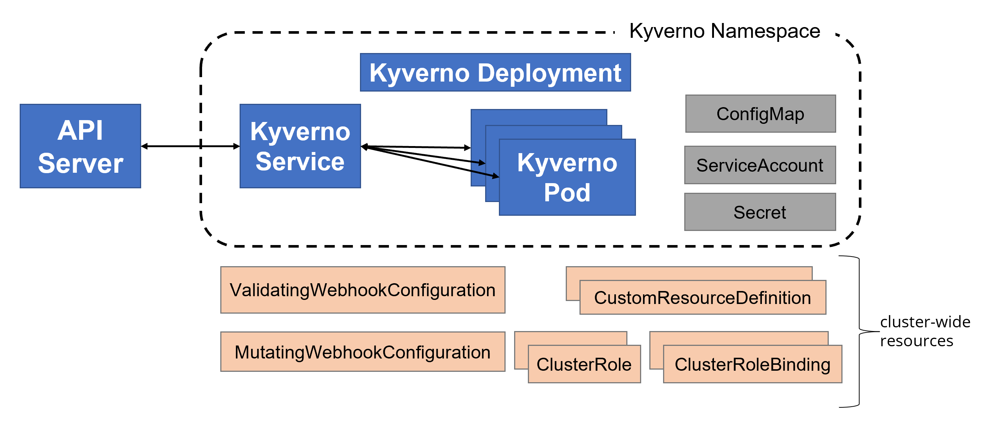

# Kyverno

## Installation Kyverno

### Kyverno Policy Engine

- https://kyverno.io/docs/installation/
- インストール方法は大きく以下2パターン
    1. helm chart
    1. manifests(yaml)

#### コンポーネント

- 以下図は [こちら](https://kyverno.io/docs/installation/#customize-the-installation-of-kyverno) から抜粋
    - 

#### TLS Configuration

- Kyverno policy engine はAdmission Webhookとして動作し、kube-apiserverとの通信でTLS通信を行うために認証局の署名がされた証明書が必要
- 自己署名証明書の作成
    - (helm chartsの) `createSelfSignedCert` (defailt: false)
        - `false`: `kube-controller-manager` で自己署名証明書作成
        - `true`: 作成済み自己署名証明書を使用する
            - https://kyverno.io/docs/installation/#option-2-use-your-own-ca-signed-certificate
- 参考
    - https://kyverno.io/docs/installation/#customize-the-installation-of-kyverno
    - https://github.com/kyverno/kyverno/blob/v1.5.1/charts/kyverno/README.md#tls-configuration
    - https://kubernetes.io/docs/reference/access-authn-authz/certificate-signing-requests/
    - https://github.com/kyverno/kyverno/blob/v1.5.1/charts/kyverno/values.yaml#L228-L238

### Webhook Configurations

- ValicatingWebhookConfiguration
- MutatingWebhookConfiguration
- 起動時に作成
    - https://github.com/kyverno/kyverno/blob/v1.5.2/cmd/kyverno/main.go#L426
    - https://github.com/kyverno/kyverno/blob/v1.5.2/cmd/initContainer/main.go#L165
    - https://github.com/kyverno/kyverno/blob/v1.5.2/pkg/webhookconfig/monitor.go#L85
- 停止時に削除
    - https://github.com/kyverno/kyverno/blob/v1.5.2/cmd/kyverno/main.go#L533-L536

#### mutatingwebhookconfigurations

- https://github.com/kyverno/kyverno/blob/v1.5.2/pkg/config/config.go#L11-L66
- [generateMutatingWebhook](https://github.com/kyverno/kyverno/blob/v1.5.2/pkg/webhookconfig/common.go#L160-L190)
    - [constructVerifyMutatingWebhookConfig](https://github.com/kyverno/kyverno/blob/v1.5.2/pkg/webhookconfig/registration.go#L488-L513)
    - [constructPolicyMutatingWebhookConfig](https://github.com/kyverno/kyverno/blob/v1.5.2/pkg/webhookconfig/policy.go#L67-L92)
    - [constructDefaultMutatingWebhookConfig](https://github.com/kyverno/kyverno/blob/v1.5.2/pkg/webhookconfig/resource.go#L58-L89)

#### validatingwebhookconfigurations

- https://github.com/kyverno/kyverno/blob/v1.5.2/pkg/config/config.go#L11-L66
- [generateValidatingWebhook](https://github.com/kyverno/kyverno/blob/v1.5.2/pkg/webhookconfig/common.go#L192-L220)
    - [constructPolicyValidatingWebhookConfig](https://github.com/kyverno/kyverno/blob/v1.5.2/pkg/webhookconfig/policy.go#L11-L37)
    - [constructDefaultValidatingWebhookConfig](https://github.com/kyverno/kyverno/blob/v1.5.2/pkg/webhookconfig/resource.go#L159-L190)

## Installation Polcies

- `Policy` もしくは `ClusterPolicy` のmanifestsを適用します
- Policyの書き方や推奨Policyについては以下ページを参照
    - https://kyverno.io/policies/
    - https://github.com/kyverno/policies
    - Privilege modeを許可しないPolicyのsample
       - https://aws.amazon.com/jp/blogs/news/easy-as-one-two-three-policy-management-with-kyverno-on-amazon-eks/

## Uninstallation Kyverno

- https://kyverno.io/docs/installation/#uninstalling-kyverno

    !!! warning

        https://github.com/kyverno/kyverno/issues/2750 
        https://github.com/kyverno/kyverno/issues/2623

        kyverno Podがdeleteされる際に `mutatingwebhookconfigurations` と `validatingwebhookconfigurations` が削除されないbugがあります。 
        (1.5.2-rc2 imageでfixしたようです)

        kyverno controllerが削除されwebhookが残っている場合、Podを起動しようとした際に以下のようなエラーとなります。

            warning: Immediate deletion does not wait for confirmation that the running resource has been terminated. The resource may continue to run on the cluster indefinitely.
            Error from server (InternalError): Internal error occurred: failed calling webhook "validate.kyverno.svc-fail": Post "https://kyverno-svc.kyverno.svc:443/validate?timeout=10s": service "kyverno-svc" not found

        手動でwebhookを削除する場合は以下ページを参照 
        https://kyverno.io/docs/installation/#clean-up-webhook-configurations

## Appendix

### `kube-controller-manager` で自己署名証明書作成

- https://kubernetes.io/docs/reference/access-authn-authz/certificate-signing-requests/
