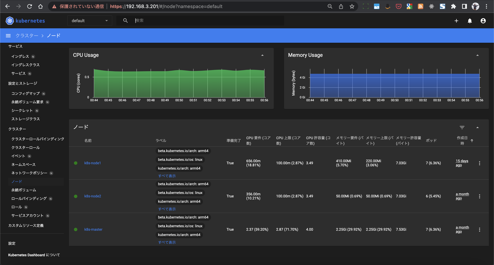

## About MetalLB

https://metallb.universe.tf/
https://github.com/metallb/metallb

Bare Metalな環境でLoadBlancerサービスを提供するaddonです。

CloudProviderが提供するKubernetesサービスでは当該CloudProviderのLoadBlancerサービスを利用できます。
AWSでは [AWS Load Balancer Controller](https://kubernetes-sigs.github.io/aws-load-balancer-controller) を導入することで[Ingressリソース](https://kubernetes-sigs.github.io/aws-load-balancer-controller/v2.2/guide/ingress/annotations/) や [Serviceリソース](https://kubernetes-sigs.github.io/aws-load-balancer-controller/v2.2/guide/service/nlb/) でElastic Load Balancerの作成を行うことが可能です。

Bare Metalな環境で[Nginx Ingress Controller](https://kubernetes.github.io/ingress-nginx/)を導入した場合、Cluster内のPod NetworkのIPアドレスがアサインされます。

私はRaspberry pi(ubuntu server)でKubernetes Clusterを構築しており、Node IPアドレスは自宅のWiFiルータ(`192.168.3.0/24`)から取得しています。
Cluster Cidr(`10.200.0.0/16`)ではMacBookなどCluster外のブラウザアクセスができず、(NAT変換などを駆使すれば可能かもしれませんが) 少々不便です。

MetalLBでは `Service` リソースで `type: LoadBalancer` を指定可能とし、かつ`192.168.3.200/27` などKubernetes Clusterの外部に公開可能なIPアドレスの割り当てが可能です。

## 参考

- https://blog.framinal.life/entry/2020/04/16/022042
- https://garafu.blogspot.com/2019/06/install-metallb.html

## Installation

- https://metallb.universe.tf/installation/

## Configuration

- https://metallb.universe.tf/configuration/
    - `IPAddressPool`
        - `type: LoadBalancer` を指定したServiceに割り当てるIPアドレスのプールを定義
    - `L2Advertisement`
        - IPアドレスのAdvertisementを行うk8s nodeを指定する
        - https://metallb.universe.tf/configuration/_advanced_l2_configuration/

    <details><summary>manifests</summary>
    ```
    ---
    apiVersion: metallb.io/v1beta1
    kind: IPAddressPool
    metadata:
      name: ip-pool
      namespace: metallb-system
    spec:
      addresses:
      - 192.168.3.200-192.168.3.210

    ---
    apiVersion: metallb.io/v1beta1
    kind: L2Advertisement
    metadata:
      name: ip-pool-advertisement
      namespace: metallb-system
    spec:
      ipAddressPools:
      - ip-pool
      nodeSelectors:
      - matchLabels:
          kubernetes.io/hostname: k8s-master
      - matchLabels:
          kubernetes.io/hostname: k8s-node1
      - matchLabels:
          kubernetes.io/hostname: k8s-node2
    ```
    </details>

## Kubernetes Dashboard をMetalLBで払い出したIPアドレスでアクセスしてみる

1. edit of kubernetes-dashboard manifests
    - [bootstrapping kubernetes-dashboard](/kubernetes-dashboard/bootstrapping_kubernetes-dashboard/) で作成した環境
        - ServiceリソースのTypeを `LoadBalancer` に変更
        - `metallb.universe.tf/address-pool` annotationsを追記
            <details><summary>/etc/kubernetes/manifests/kubernetes-dashboard.yaml の修正後のdiff</summary>
            ```
            @@ -36,7 +36,10 @@
                 k8s-app: kubernetes-dashboard
               name: kubernetes-dashboard
               namespace: kubernetes-dashboard
            +  annotations:
            +    metallb.universe.tf/address-pool: ip-pool
             spec:
            +  type: LoadBalancer
               ports:
                 - port: 443
                   targetPort: 8443
            ```
            </details>

1. apply kubernetes-dashboard manifests
    ```
    kubectl apply -f /etc/kubernetes/manifests/kubernetes-dashboard.yaml
    ```

1. check service and ingress

    <details><summary>service</summary>
    ```
    $ kubectl describe svc -n kubernetes-dashboard kubernetes-dashboard
    Name:                     kubernetes-dashboard
    Namespace:                kubernetes-dashboard
    Labels:                   k8s-app=kubernetes-dashboard
    Annotations:              metallb.universe.tf/address-pool: ip-pool
    Selector:                 k8s-app=kubernetes-dashboard
    Type:                     LoadBalancer
    IP Family Policy:         SingleStack
    IP Families:              IPv4
    IP:                       10.32.0.177
    IPs:                      10.32.0.177
    LoadBalancer Ingress:     192.168.3.201
    Port:                     <unset>  443/TCP
    TargetPort:               8443/TCP
    NodePort:                 <unset>  30522/TCP
    Endpoints:                10.200.2.78:8443
    Session Affinity:         None
    External Traffic Policy:  Cluster
    Events:
      Type    Reason        Age                 From                Message
      ----    ------        ----                ----                -------
      Normal  IPAllocated   53m                 metallb-controller  Assigned IP ["192.168.3.201"]
      Normal  nodeAssigned  50s (x34 over 53m)  metallb-speaker     announcing from node "k8s-master" with protocol "layer2"
    ```
    </details>

    <details><summary>ingress</summary>
    ```
    $ kubectl describe ingress -n kubernetes-dashboard dashboard-ingress
    Name:             dashboard-ingress
    Labels:           <none>
    Namespace:        kubernetes-dashboard
    Address:          192.168.3.200
    Ingress Class:    <none>
    Default backend:  <default>
    TLS:
      dashboard-secret-tls terminates k8s-dashboard.local
    Rules:
      Host                 Path  Backends
      ----                 ----  --------
      k8s-dashboard.local
                           /   kubernetes-dashboard:443 (10.200.2.78:8443)
    Annotations:           kubernetes.io/ingress.class: nginx
                           nginx.ingress.kubernetes.io/backend-protocol: HTTPS
                           nginx.ingress.kubernetes.io/ssl-passthrough: true
    Events:
      Type    Reason  Age                From                      Message
      ----    ------  ----               ----                      -------
      Normal  Sync    53m (x2 over 54m)  nginx-ingress-controller  Scheduled for sync
    ```
    </details>

1. Serviceに割り当てられている `192.168.3.201` でアクセスできることを確認
    - NodePortなどの指定は不要なのでアクセスが手軽
    - 
