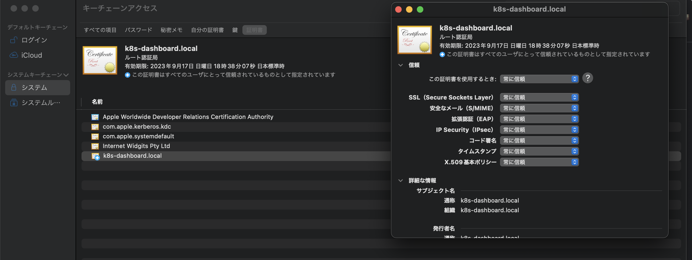
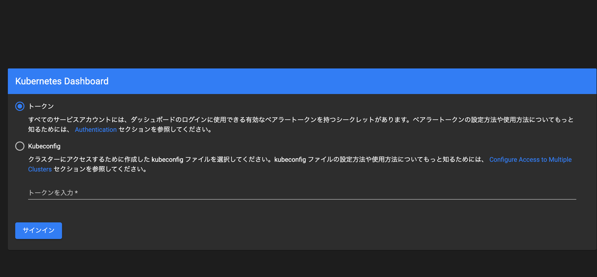
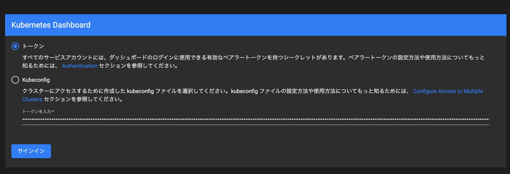
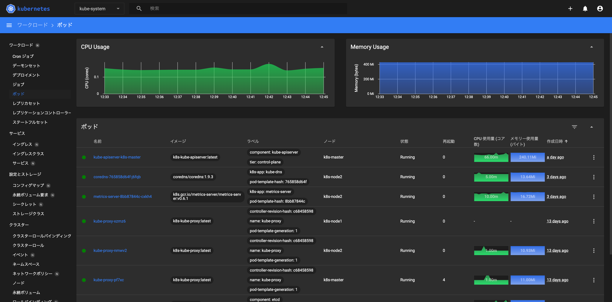

## about kubernetes-dashboard

https://github.com/kubernetes/dashboard

Kubernetes Dashboardは、Kubernetesクラスタ用の汎用的なWebベースのUIです。クラスターで動作するアプリケーションの管理やトラブルシューティングのほか、クラスター自体の管理も可能です。

### 参考

- https://github.com/kubernetes/dashboard/blob/master/docs/common/dashboard-arguments.md
- https://itnext.io/how-to-expose-your-kubernetes-dashboard-with-cert-manager-422ab1e3bf30
- https://magda.io/docs/how-to-setup-https-to-local-cluster.html
- https://vmwire.com/2022/02/07/running-kubernetes-dashboard-with-signed-certificates/
- https://stackoverflow.com/questions/46664104/how-to-sign-in-kubernetes-dashboard
- https://stackoverflow.com/questions/46664104/how-to-sign-in-kubernetes-dashboard

### install

1. create self signed certificate

    ```
    openssl req -x509 -nodes -days 365 -newkey rsa:2048 -keyout kubernetes-dashboard.key -out kubernetes-dashboard.crt -subj "/CN=k8s-dashboard.local/O=k8s-dashboard.local"
    kubectl create secret generic kubernetes-dashboard-certs --from-file=./ -n kubernetes-dashboard
    ```

1. self-signed certificates regist to key chain(Mac OSX)

    - Chromeでアクセスした際に不正な証明書として拒否されないように自己署名証明書を信頼済み証明書として登録する
    - 

1. download kubernetes-dashboard manifests

    ```
    sudo curl -o /etc/kubernetes/manifests/kubernetes-dashboard.yaml https://raw.githubusercontent.com/kubernetes/dashboard/v2.7.0/aio/deploy/recommended.yaml
    ```

1. edit of kubernetes-dashboard manifests

    ```
    sudo vim /etc/kubernetes/manifests/kubernetes-dashboard.yaml
    ```

      - ServiceリソースのTypeを `NodePort` に変更

          <details><summary>diff</summary>
          ```
          @@ -37,6 +37,7 @@
             name: kubernetes-dashboard
             namespace: kubernetes-dashboard
           spec:
          +  type: NodePort
             ports:
               - port: 443
                 targetPort: 8443
          ```

          </details>

      - kubernetes-dashboardコンテナの起動オプションにTLS証明書ファイルとTLS鍵ファイルを指定する

          <details><summary>diff</summary>

          ```
          @@ -198,6 +199,8 @@
                     args:
                       - --auto-generate-certificates
                       - --namespace=kubernetes-dashboard
          +            - --tls-cert-file=/tls.crt
          +            - --tls-key-file=/tls.key
          ```

          </details>

1. apply kubernetes-dashboard manifests

    ```
    kubectl apply -f /etc/kubernetes/manifests/kubernetes-dashboard.yaml
    ```

1. adding fqdn and node ip address to `/etc/hosts`
    - get node ip

        ```
        kubectl get pods -n kubernetes-dashboard -l k8s-app=kubernetes-dashboard -o json | jq -r .items[].status.hostIP
        ```

    - adding entry to `/etc/hosts`

        ```
        <Node IP ADDRESS> `k8s-dashboard.local`
        ```

1. get node port

    ```
    kubectl get service -n kubernetes-dashboard kubernetes-dashboard -o json | jq -r .spec.ports[].nodePort
    ```

1. access kubernetes-dashboard with browser
    - `https://k8s-dashboard.local:<node port of previous command result>`
        - 

1. create token strings

    ```
    kubectl create serviceaccount dashboard -n default
    kubectl create clusterrolebinding dashboard-admin -n default --clusterrole=cluster-admin --serviceaccount=default:dashboard
    TOKEN=`kubectl get secret $(kubectl get serviceaccount dashboard -o jsonpath="{.secrets[0].name}") -o jsonpath="{.data.token}" | base64 --decode`
    echo $TOKEN
    ```

1. input token and login
    - input previous command result as token strings
    - 

1. login successed
    - 

