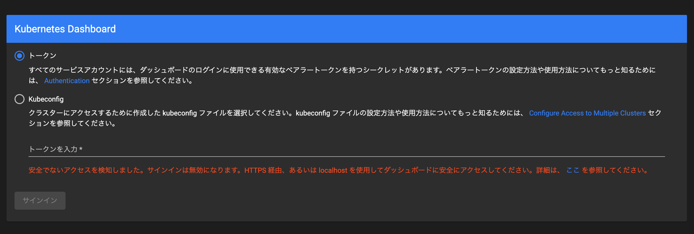

# kubernetes dashboard

## 参考

- https://github.com/kubernetes/dashboard
- https://kubernetes.io/ja/docs/tasks/access-application-cluster/web-ui-dashboard/


## 構築手順

### インストール (manual)

1. デプロイ
    ```
    $ kubectl apply -f https://raw.githubusercontent.com/kubernetes/dashboard/v2.5.0/aio/deploy/recommended.yaml
    namespace/kubernetes-dashboard created
    serviceaccount/kubernetes-dashboard created
    service/kubernetes-dashboard created
    secret/kubernetes-dashboard-certs created
    secret/kubernetes-dashboard-csrf created
    secret/kubernetes-dashboard-key-holder created
    configmap/kubernetes-dashboard-settings created
    role.rbac.authorization.k8s.io/kubernetes-dashboard created
    clusterrole.rbac.authorization.k8s.io/kubernetes-dashboard created
    rolebinding.rbac.authorization.k8s.io/kubernetes-dashboard created
    clusterrolebinding.rbac.authorization.k8s.io/kubernetes-dashboard created
    deployment.apps/kubernetes-dashboard created
    service/dashboard-metrics-scraper created
    deployment.apps/dashboard-metrics-scraper created
    ```
      - log(kubernetes-dashboard)
          ```
          $ kubectl logs -n kubernetes-dashboard kubernetes-dashboard-764b4dd7-qsq28 -f
          2022/02/19 12:14:19 Starting overwatch
          2022/02/19 12:14:19 Using namespace: kubernetes-dashboard
          2022/02/19 12:14:19 Using in-cluster config to connect to apiserver
          2022/02/19 12:14:19 Using secret token for csrf signing
          2022/02/19 12:14:19 Initializing csrf token from kubernetes-dashboard-csrf secret
          2022/02/19 12:14:20 Empty token. Generating and storing in a secret kubernetes-dashboard-csrf
          2022/02/19 12:14:20 Successful initial request to the apiserver, version: v1.22.0
          2022/02/19 12:14:20 Generating JWE encryption key
          2022/02/19 12:14:20 New synchronizer has been registered: kubernetes-dashboard-key-holder-kubernetes-dashboard. Starting
          2022/02/19 12:14:20 Starting secret synchronizer for kubernetes-dashboard-key-holder in namespace kubernetes-dashboard
          2022/02/19 12:14:21 Initializing JWE encryption key from synchronized object
          2022/02/19 12:14:21 Creating in-cluster Sidecar client
          2022/02/19 12:14:21 Metric client health check failed: the server is currently unable to handle the request (get services dashboard-metrics-scraper). Retrying in 30 seconds.
          2022/02/19 12:14:21 Auto-generating certificates
          2022/02/19 12:14:21 Successfully created certificates
          2022/02/19 12:14:21 Serving securely on HTTPS port: 8443
          2022/02/19 12:14:51 Successful request to sidecar
          2022/02/19 12:19:28 Getting application global configuration
          2022/02/19 12:19:28 Application configuration {"serverTime":1645273168318}
          ```
      - log(dashboard-metrics-scraper)
          ```
          $ kubectl logs -n kubernetes-dashboard dashboard-metrics-scraper-c45b7869d-x465w -f
          {"level":"info","msg":"Kubernetes host: https://10.32.0.1:443","time":"2022-02-19T12:14:49Z"}
          {"level":"info","msg":"Namespace(s): []","time":"2022-02-19T12:14:49Z"}
          10.200.1.0 - - [19/Feb/2022:12:14:51 +0000] "GET /healthz HTTP/1.1" 200 13 "" "dashboard/v2.5.0"
          10.200.1.0 - - [19/Feb/2022:12:15:21 +0000] "GET /healthz HTTP/1.1" 200 13 "" "dashboard/v2.5.0"
          10.200.0.1 - - [19/Feb/2022:12:15:26 +0000] "GET / HTTP/1.1" 200 6 "" "kube-probe/1.22"
          10.200.0.1 - - [19/Feb/2022:12:15:36 +0000] "GET / HTTP/1.1" 200 6 "" "kube-probe/1.22"
          {"level":"info","msg":"Database updated: 2 nodes, 10 pods","time":"2022-02-19T12:15:50Z"}
          10.200.1.0 - - [19/Feb/2022:12:15:51 +0000] "GET /healthz HTTP/1.1" 200 13 "" "dashboard/v2.5.0"
          10.200.0.1 - - [19/Feb/2022:12:15:56 +0000] "GET / HTTP/1.1" 200 6 "" "kube-probe/1.22"
          ```

1. httpsアクセス用証明書の作成
    - [Accessing Dashboard](https://github.com/kubernetes/dashboard/tree/master/docs/user/accessing-dashboard) では`kubectl proxy`を使用したアクセス方法を提示していますが、
      Cluster外からアクセスするためにはIngressを作成し指定したドメインでアクセスする必要があります
        ```
        cat << EOF > dashboard-csr.json
        {
            "CN": "dashboard",
            "hosts": ["kubernetes-dashboard.local"],
            "key": {
                "algo": "rsa",
                "size": 2048
            },
            "names": [
                {
                    "C": "JP",
                    "L": "Tokyo",
                    "O": "system:dashboard",
                    "OU": "Kubernetes The HardWay",
                    "ST": "Sample"
                }
            ]
        }
        EOF

        cfssl gencert \
          -ca=ca.pem \
          -ca-key=ca-key.pem \
          -config=ca-config.json \
          -profile=kubernetes \
          dashboard-csr.json | cfssljson -bare dashboard
        ```
    - 以下ファイルが作成されます
        - dashboard-key.pem
        - dashboard.pem

1. 証明書と鍵をsecretで管理する
    ```
    kubectl create secret tls kubernetes-dashboard-certs --key dashboard-key.pem --cert dashboard.pem -n kube-system
    ```

1. dashboardへアクセスするためのIngressを作成する
    ```
    cat << EOF | kubectl apply --kubeconfig admin.kubeconfig -f -
    ---
    apiVersion: networking.k8s.io/v1
    kind: Ingress
    metadata:
      annotations:
        kubernetes.io/ingress.class: nginx
        nginx.ingress.kubernetes.io/backend-protocol: HTTPS
        nginx.ingress.kubernetes.io/configuration-snippet: |-
          proxy_ssl_server_name on;
          proxy_ssl_name kubernetes-dashboard.local;
      name: dashboard-ingress
      namespace: kubernetes-dashboard
    spec:
      tls:
      - hosts:
          - kubernetes-dashboard.local
        secretName: dashboard-tls
      rules:
      - host: kubernetes-dashboard.local
        http:
          paths:
          - path: /
            pathType: Prefix
            backend:
              service:
                name: kubernetes-dashboard
                port:
                  number: 443
    EOF
    ```

### 起動

1. kube-apiserver` へCluster外からアクセスできるようにproxyサーバを起動する
    - https://kubernetes.io/ja/docs/tasks/access-application-cluster/web-ui-dashboard/
    - https://github.com/kubernetes/dashboard/blob/master/docs/user/accessing-dashboard/README.md#kubectl-proxy
        ```
        kubectl proxy --address 0.0.0.0 --accept-hosts=192.168.10.*
        ```

1. ブラウザから `http://192.168.10.50:8001/api/v1/namespaces/kubernetes-dashboard/services/https:kubernetes-dashboard:/proxy/` へアクセスする
    - *ServiceAccountのTokenやkubeconfigのいずれかを指定してログインする*
    - 

### sample user作成

https://github.com/kubernetes/dashboard/blob/master/docs/user/access-control/creating-sample-user.md

1. `admin-user` ServiceAccountにスーパーユーザ権限である`cluster-admin` cluster roleを設定し作成する
    ```
    cat <<EOF | kubectl apply -f -
    ---
    apiVersion: v1
    kind: ServiceAccount
    metadata:
      name: admin-user
      namespace: kubernetes-dashboard

    ---
    apiVersion: rbac.authorization.k8s.io/v1
    kind: ClusterRoleBinding
    metadata:
      name: admin-user
    roleRef:
      apiGroup: rbac.authorization.k8s.io
      kind: ClusterRole
      name: cluster-admin
    subjects:
    - kind: ServiceAccount
      name: admin-user
      namespace: kubernetes-dashboard
    EOF
    ```

1. Bearer Token取得
    ```
    kubectl -n kubernetes-dashboard get secret $(kubectl -n kubernetes-dashboard get sa/admin-user -o jsonpath="{.secrets[0].name}") -o go-template="{{.data.token | base64decode}}"
    ```


### インストール (helm)

```
helm upgrade kubernetes-dashboard kubernetes-dashboard/kubernetes-dashboard \
  --set=ingress.enabled=true \
  --set=ingress.className=nginx \
  --set=service.type=NodePort \
  --set=service.nodePort=30001 \
  --set=protocolHttp=true
```


